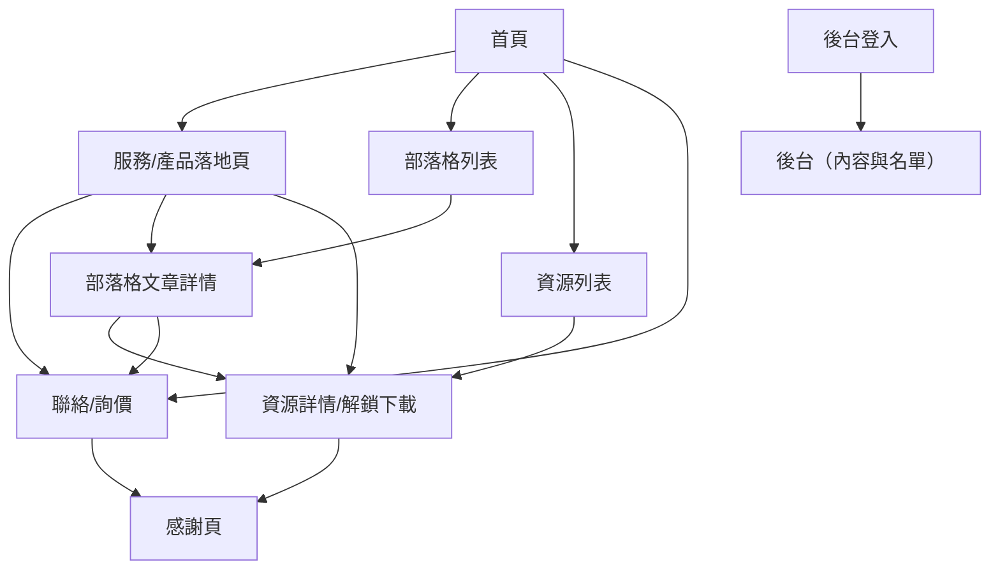

## 1. Product Overview
雙語（繁中/英文）的出口導向 Lead Generation 官網，核心目標是「被搜尋到 → 建立信任 → 留下名單/詢價」。
包含可擴充的部落格與 Lead Magnet（資源下載）機制，並落實技術 SEO 與結構化資料。

## 2. Core Features

### 2.1 User Roles
| 角色 | 註冊/登入方式 | 核心權限 |
|------|--------------|----------|
| 訪客（潛在客戶） | 無需登入 | 瀏覽雙語內容、提交詢價/聯絡表單、填表後下載資源 |
| 內容管理者（Admin） | Email + 密碼登入 | 管理頁面/落地頁內容、部落格文章與翻譯、上傳 Lead Magnet 檔案、查看名單 |

### 2.2 Feature Module
本網站需求由以下主要頁面構成：
1. **首頁**：核心價值主張、主要 CTA、精選落地頁入口、信任元素。
2. **服務/產品落地頁（可多個）**：出口關鍵字導向內容、內部連結、FAQ、表單 CTA。
3. **資源下載（Lead Magnets）**：資源列表、資源詳情、填表解鎖下載、追蹤下載。
4. **部落格**：文章列表（分類/標籤/分頁）、文章詳情（雙語）、內部連結與推薦閱讀。
5. **聯絡/詢價**：表單、公司資訊（可選）、送出後感謝頁。
6. **後台（內容與名單）**：文章/落地頁/資源管理、名單檢視與匯出。

### 2.3 Page Details
| Page Name | Module Name | Feature description |
|-----------|-------------|---------------------|
| 首頁 | 語系切換 | 切換繁中/英文並保留目前頁面語意 URL（含 hreflang 對應）。 |
| 首頁 | Hero + 主 CTA | 呈現出口定位價值主張、主要 CTA（詢價/下載資源/聯絡）。 |
| 首頁 | 精選入口 | 連到關鍵服務/產品落地頁、精選部落格與精選資源。 |
| 首頁 | 信任區塊 | 展示能力/流程/客群或證據（文字/Logo/指標），支援雙語內容。 |
| 服務/產品落地頁 | SEO 內容區 | 呈現 H1、摘要、細節段落、應用情境、常見問題（FAQ）。 |
| 服務/產品落地頁 | 內部連結模組 | 連到相關落地頁、相關文章、相關資源（規則化生成）。 |
| 服務/產品落地頁 | 表單 CTA | 提供「詢價/聯絡」短表單或跳轉至聯絡頁，帶入來源參數。 |
| 資源下載 | 資源列表 | 以卡片呈現資源（標題、摘要、適用對象、語系、更新日）。 |
| 資源下載 | 資源詳情 + 解鎖 | 顯示內容大綱、價值、下載表單；送出後產生一次性下載連結。 |
| 資源下載 | 下載追蹤 | 記錄下載事件（資源、語系、來源頁、時間、lead id）。 |
| 部落格 | 列表/分頁 | 依語系顯示文章列表，支援分類/標籤篩選與分頁。 |
| 部落格 | 文章詳情 | 顯示文章內容、作者/日期、目錄、推薦閱讀、CTA（下載/詢價）。 |
| 聯絡/詢價 | 表單提交 | 收集必填欄位（公司/姓名/Email/需求），寫入名單並回傳成功狀態。 |
| 聯絡/詢價 | 感謝頁 | 顯示下一步指引（可下載/預約/回信期待），保留 UTM 與來源資訊。 |
| 後台 | 登入/權限 | 管理者登入後才能存取後台；未登入導向登入頁。 |
| 後台 | 內容管理 | 新增/編輯/發布落地頁、部落格文章（含雙語欄位）、資源內容。 |
| 後台 | 檔案管理 | 上傳/替換 Lead Magnet 檔案（PDF 等），設定下載對應。 |
| 後台 | 名單管理 | 檢視名單、搜尋/篩選、匯出 CSV、查看來源與下載紀錄。 |
| 全站（系統） | 技術 SEO | 產生 sitemap.xml、robots.txt、canonical、hreflang、OG、404。 |
| 全站（系統） | Schema（JSON-LD） | 依頁型輸出 Organization/WebSite/WebPage/Breadcrumb/Article/FAQ 等。 |

## 3. Core Process
### 訪客（潛在客戶）流程
1. 透過搜尋或外部連結進入（首頁/落地頁/文章/資源）。
2. 以語系切換閱讀（ZH/EN），並透過「相關內容」內部連結持續探索。
3. 在落地頁或文章看到 CTA：
   - 直接「詢價/聯絡」→ 送出表單 → 感謝頁。
   - 或選擇「下載資源」→ 進入資源詳情 → 填表解鎖 → 下載完成。

### 管理者（Admin）流程
1. 登入後台。
2. 新增/編輯落地頁、文章（含翻譯）、FAQ 與內部連結關聯。
3. 上傳資源檔並發布資源頁。
4. 定期查看名單與下載成效，匯出名單跟進。

