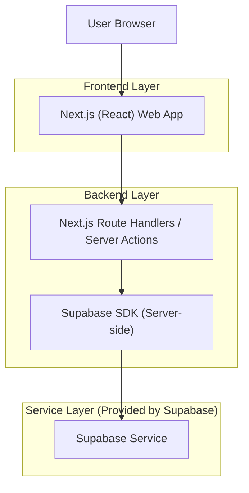
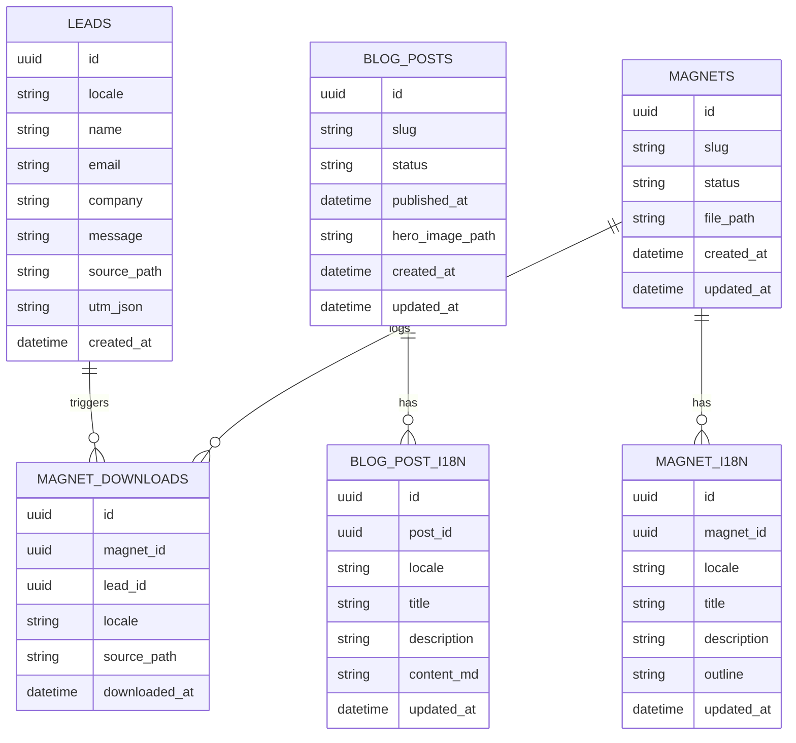

## 1.Architecture design


## 2.Technology Description
- Frontend: React@18 + Next.js(App Router) + tailwindcss@3
- Backend: Next.js Route Handlers / Server Actions（用於表單、一次性下載連結、後台 CRUD）
- Database/Auth/Storage: Supabase（PostgreSQL + Auth + Storage）
- i18n: next-intl（或等價方案），以 URL 形式區分語系（/zh、/en）

## 3.Route definitions
| Route | Purpose |
|-------|---------|
| /zh | 繁中首頁 |
| /en | 英文首頁 |
| /[locale]/lp/[slug] | 服務/產品落地頁（SEO 內容、FAQ、CTA、內部連結） |
| /[locale]/blog | 部落格列表（分類/標籤/分頁） |
| /[locale]/blog/[slug] | 文章詳情（Article schema、推薦閱讀、CTA） |
| /[locale]/resources | 資源/Lead Magnets 列表 |
| /[locale]/resources/[slug] | 資源詳情（填表解鎖下載） |
| /[locale]/contact | 聯絡/詢價表單 |
| /[locale]/thanks | 感謝頁 |
| /admin/login | 後台登入 |
| /admin | 後台（內容/資源/名單） |

## 4.API definitions (If it includes backend services)
### 4.1 Core API
提交詢價/聯絡名單
```
POST /api/leads
```
Request:
| Param Name| Param Type  | isRequired  | Description |
|-----------|-------------|-------------|-------------|
| locale | "zh" \| "en" | true | 語系 |
| name | string | true | 聯絡人姓名 |
| email | string | true | Email |
| company | string | false | 公司名稱 |
| message | string | true | 需求描述 |
| sourcePath | string | true | 來源頁路徑 |
| utm | Record<string,string> | false | UTM 參數集合 |

Response:
| Param Name| Param Type  | Description |
|-----------|-------------|-------------|
| leadId | string | 名單 ID |
| ok | boolean | 是否成功 |

解鎖資源下載（建立一次性下載 token）
```
POST /api/magnets/unlock
```
Request:
| Param Name| Param Type  | isRequired  | Description |
|-----------|-------------|-------------|-------------|
| locale | "zh" \| "en" | true | 語系 |
| magnetSlug | string | true | 資源 slug |
| lead | LeadCaptureInput | true | 表單欄位（同 /api/leads，可精簡） |

Response:
| Param Name| Param Type  | Description |
|-----------|-------------|-------------|
| downloadUrl | string | 有效期限內的下載 URL |
| ok | boolean | 是否成功 |

管理端：文章 CRUD（需管理者權限）
```
GET /api/admin/posts
POST /api/admin/posts
PATCH /api/admin/posts/:id
```

### 4.2 Shared TypeScript types（概念）
```ts
type Locale = "zh" | "en";

type Lead = {
  id: string;
  locale: Locale;
  name: string;
  email: string;
  company?: string;
  message: string;
  source_path: string;
  utm?: Record<string, string>;
  created_at: string;
};

type BlogPost = {
  id: string;
  slug: string;
  status: "draft" | "published";
  published_at?: string;
  hero_image_path?: string;
};

type BlogPostI18n = {
  id: string;
  post_id: string;
  locale: Locale;
  title: string;
  description?: string;
  content_md: string;
};

type Magnet = {
  id: string;
  slug: string;
  file_path: string; // Supabase Storage
  status: "draft" | "published";
};

type MagnetI18n = {
  id: string;
  magnet_id: string;
  locale: Locale;
  title: string;
  description?: string;
  outline?: string;
};
```

## 6.Data model(if applicable)
### 6.1 Data model definition


### 6.2 Data Definition Language
LEADS
```
CREATE TABLE leads (
  id UUID PRIMARY KEY DEFAULT gen_random_uuid(),
  locale VARCHAR(5) NOT NULL CHECK (locale IN ('zh','en')),
  name VARCHAR(120) NOT NULL,
  email VARCHAR(255) NOT NULL,
  company VARCHAR(255),
  message TEXT NOT NULL,
  source_path TEXT NOT NULL,
  utm_json JSONB,
  created_at TIMESTAMPTZ DEFAULT NOW()
);

CREATE INDEX idx_leads_created_at ON leads(created_at DESC);
CREATE INDEX idx_leads_email ON leads(email);

GRANT SELECT ON leads TO authenticated;
GRANT ALL PRIVILEGES ON leads TO authenticated;
```

BLOG（不使用實體外鍵，採用 application-level 關聯）
```
CREATE TABLE blog_posts (
  id UUID PRIMARY KEY DEFAULT gen_random_uuid(),
  slug VARCHAR(200) UNIQUE NOT NULL,
  status VARCHAR(20) NOT NULL DEFAULT 'draft' CHECK (status IN ('draft','published')),
  published_at TIMESTAMPTZ,
  hero_image_path TEXT,
  created_at TIMESTAMPTZ DEFAULT NOW(),
  updated_at TIMESTAMPTZ DEFAULT NOW()
);

CREATE TABLE blog_post_i18n (
  id UUID PRIMARY KEY DEFAULT gen_random_uuid(),
  post_id UUID NOT NULL,
  locale VARCHAR(5) NOT NULL CHECK (locale IN ('zh','en')),
  title TEXT NOT NULL,
  description TEXT,
  content_md TEXT NOT NULL,
  updated_at TIMESTAMPTZ DEFAULT NOW()
);

CREATE UNIQUE INDEX uq_blog_post_i18n ON blog_post_i18n(post_id, locale);
CREATE INDEX idx_blog_post_i18n_locale ON blog_post_i18n(locale);

GRANT SELECT ON blog_posts TO anon;
GRANT SELECT ON blog_post_i18n TO anon;
GRANT ALL PRIVILEGES ON blog_posts TO authenticated;
GRANT ALL PRIVILEGES ON blog_post_i18n TO authenticated;
```

MAGNETS
```
CREATE TABLE magnets (
  id UUID PRIMARY KEY DEFAULT gen_random_uuid(),
  slug VARCHAR(200) UNIQUE NOT NULL,
  status VARCHAR(20) NOT NULL DEFAULT 'draft' CHECK (status IN ('draft','published')),
  file_path TEXT NOT NULL,
  created_at TIMESTAMPTZ DEFAULT NOW(),
  updated_at TIMESTAMPTZ DEFAULT NOW()
);

CREATE TABLE magnet_i18n (
  id UUID PRIMARY KEY DEFAULT gen_random_uuid(),
  magnet_id UUID NOT NULL,
  locale VARCHAR(5) NOT NULL CHECK (locale IN ('zh','en')),
  title TEXT NOT NULL,
  description TEXT,
  outline TEXT,
  updated_at TIMESTAMPTZ DEFAULT NOW()
);

CREATE TABLE magnet_downloads (
  id UUID PRIMARY KEY DEFAULT gen_random_uuid(),
  magnet_id UUID NOT NULL,
  lead_id UUID NOT NULL,
  locale VARCHAR(5) NOT NULL CHECK (locale IN ('zh','en')),
  source_path TEXT NOT NULL,
  downloaded_at TIMESTAMPTZ DEFAULT NOW()
);

CREATE UNIQUE INDEX uq_magnet_i18n ON magnet_i18n(magnet_id, locale);
CREATE INDEX idx_magnet_downloads_time ON magnet_downloads(downloaded_at DESC);

GRANT SELECT ON magnets TO anon;
GRANT SELECT ON magnet_i18n TO anon;
GRANT ALL PRIVILEGES ON magnets TO authenticated;
GRANT ALL PRIVILEGES ON magnet_i18n TO authenticated;
GRANT ALL PRIVILEGES ON magnet_downloads TO authenticated;
```

技術 SEO 落地要點（實作原則）
- hreflang：每個頁面輸出 zh/en 互指，並設定 x-default（如有）。
- canonical：同語系內自我指向；避免參數頁被索引。
- sitemap：輸出雙語 URL（含 blog、resources、lp）。
- Schema：依頁型輸出 JSON-LD（Organization/WebSite/WebPage/BreadcrumbList/Article/FAQPage）。
